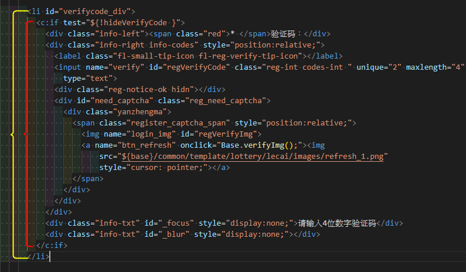
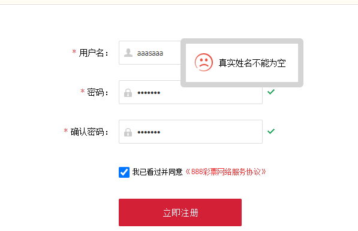
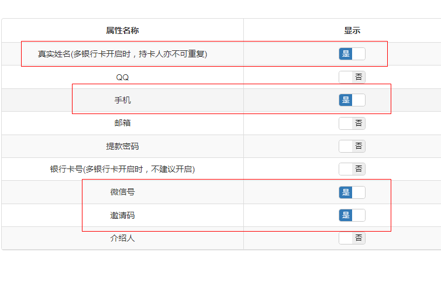
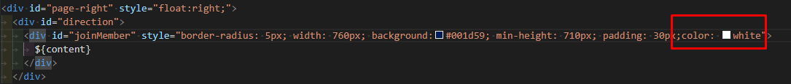

# 常見問題

# 大綱

- [手寫註冊選項，後台與前台不同步](https://www.notion.so/05e6e844307741a69d5d6ba8af1a62af)
- [關於我們內文顏色](https://www.notion.so/05e6e844307741a69d5d6ba8af1a62af)
- [logo相關](https://www.notion.so/05e6e844307741a69d5d6ba8af1a62af)

# 手寫註冊選項，後台與前台不同步

解決方法：修改順序，詳細說明看[手寫註冊](https://www.notion.so/7e16aece855a42d6b881b69cd63041db)

**確保verifycode_div是在${!hideVerifyCode}的外層**

# 關於我們內文顏色

遇到客服要求更改關於我們的文字顏色，可直接在父層加上顏色樣式。

# logo相關

網頁logo圖片問題`參考：[網頁logo相關](https://www.notion.so/3a292c3cab4445caac7a3eb05ec2f048)`