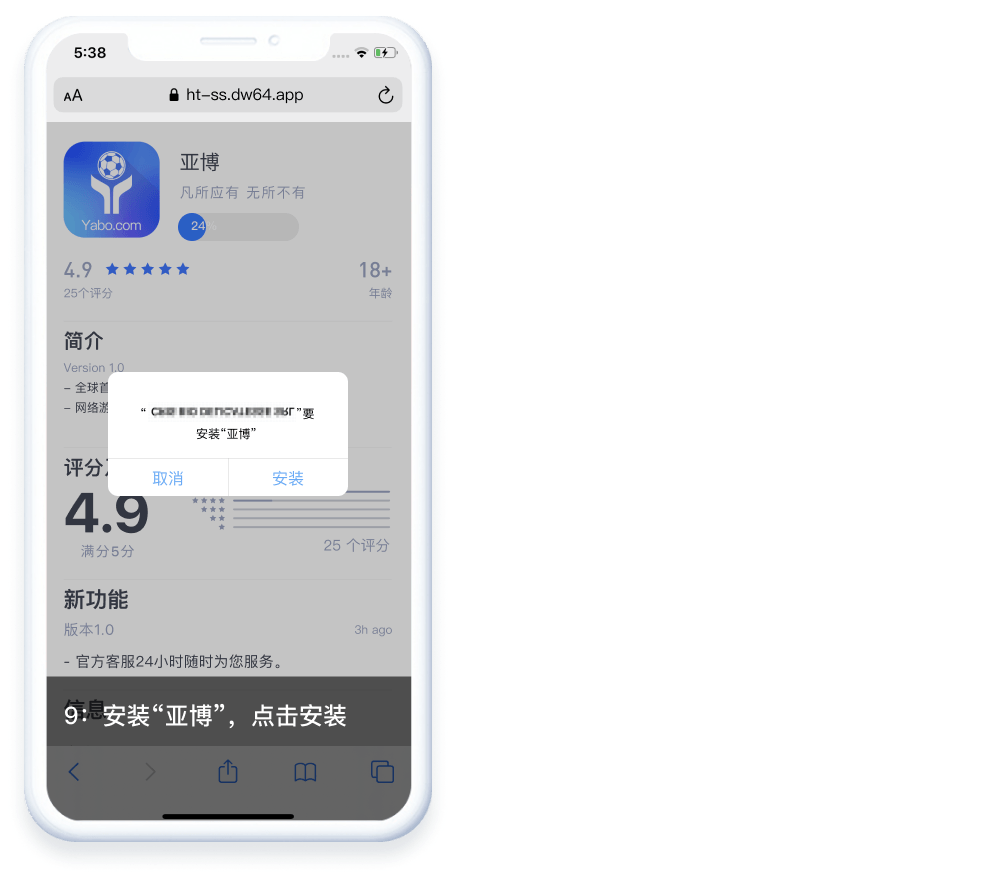

# 站點與檔案結構介紹

- [站點介紹](https://www.notion.so/a7482a400ca146449514dc4380bd9d66)
- [V3 V5版本檔案結構](https://www.notion.so/a7482a400ca146449514dc4380bd9d66)
- [彩票投注頁](https://www.notion.so/a7482a400ca146449514dc4380bd9d66)
- [會員中心](https://www.notion.so/a7482a400ca146449514dc4380bd9d66)
- [會員等級圖標](https://www.notion.so/a7482a400ca146449514dc4380bd9d66)
- [超級簽](https://www.notion.so/a7482a400ca146449514dc4380bd9d66)

# 站點介紹

**☞[站點查詢](https://docs.google.com/spreadsheets/d/1LouvWVrb4i-QC4CPGTVttBhDn9DTPAklIWT3EyogZbE/edit#gid=267136430)**:可以搜相似站點 不是大全但是持續更新中

| member | 彩票版本 | 獎金版與否 | 站別 | 備註 |
| --- | --- | --- | --- | --- |
| a001 | V1 捷豹版 | 預設(是) |  | 現有站點不多 |
| a002 | V2 | 否(賠率) | B站 | 客製度高 |
| a003 | V2.1 | 否(賠率) | A站 | 客製度高 |
| a004 | V3 | 是(獎金) | D站 | 前台默认主页：/lotteryV3/index.do
客製度低，幾乎是公共頁 參考：d015 |
| a005 | V5 | 否(賠率) | D站 | 前台默认主页:/lotteryV3/index.do 
客製度低，幾乎是公共頁
v5版的include都是固定區塊可以調
版型樣式位置內容每一個v5都一樣。 |

# V3 V5版本檔案結構

### 用頁面辨別V3 V5

# 彩票投注頁

投注頁面有四個版本，捷豹、V2、V2-1、V3、V5各有不同。

### **V1`捷豹版`**

### **V2**

### **V2-1**

### **V3**

### **V5**

# 會員中心

會員中心有四個版本，捷豹、 V2、 V2-1、 V3、V5各有不同。

### V1**`捷豹版` 在彩票投注頁面內`可切換顏色`**

### **V2**

### **V2-1 在彩票投注頁面內 `可切換顏色`**

### **V3 & V5**

# 會員等級圖標

會員等級圖標可以透過後台來設定。`參考：[後台配置](https://www.notion.so/9a17ad52087c44e1a579d668e475fe06)`

### V2-1

### V3 & V5

### 手機V3版

# 超級簽

> 博弈類型的app沒辦法在官方通過審核上架，透過假的商店頁面教客戶如何下載我們的app，此功能稱為超級簽，以亞博教程做解釋。`有興趣深入瞭解可以自行下載我們公司的app走一次流程試試`
> 

