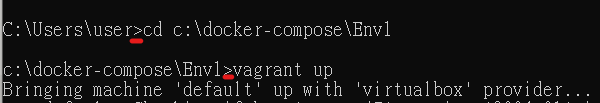
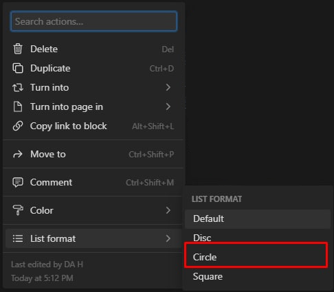

# 筆記規範

> 筆記的用途是幫助大家熟悉工作內容，且遇到問題時，可以快速找到對應的答案
因此筆記的正確性跟可閱讀性就非常重要
規範目的是希望大家在新增筆記前，可以有個規則可以依循，才不會導致共同筆記亂糟糟
> 
- **正確性**
確保新增筆記前經過各種測試跟驗證再丟上來，不會放了一堆不能用的code造成作業上的困擾。
- **可閱讀性**
在有回覆客服的時間壓力下，如何快速找到想要的code以及使用方式，尤其針對懶得看字的現代人這點特別重要！此時附圖、分大標小標、code的統一書寫方式都是增加可閱讀性的方式。

## 更新

- 當發現筆記上的code沒辦法用或是資訊有更動時，一定要回頭來筆記修改正確，避免還要花時間判斷code可用性。

## 美化

- 大家對這個軟體還不是很熟悉，美化會花比較多時間，先達到資料的正確性跟可閱讀性有時間再做美化的部分。
- 先以個人審美為主，筆記會由主管不斷去審核，如果有覺得需要優化的部分請虛心接受前UI設計師的建議！

## 書寫方式

- 筆記統一用繁體中文，模版相關、後台操作說明、code以簡體為主才好複製貼上`含code註解`。
- 英文字大小寫盡量全部統一，如有官方標準拼寫法，就以官方為主，例如：官方用TortoiseGit就不要有tortoiseGit。
- 標題要明顯，段落要清楚`擅用tab退格`，活用標點符號`標點符號用全形`，學會標重點。
- **Quote樣式**:前言`藍底`、範例`黃底` 、說明區塊`紫底`。
- 內文超過兩行即為說明區塊`紫底`，遇到例外再討論。
- 說明的說明文字和＂參考:＂用**mark as code**<>灰底小字標，並放在句號後。
- 跳轉區塊使用藍色字體加底線，站點查詢例外
- CMD指令以 /code>plain text為主 每行以>開頭，跟實際CMD指令比較符合 。

- 內文裡的標題統一heading1 ，大綱heading2，標題內的各種步驟、分類等用一heading3。
- 順序性內文用數字標題`Numbered list`，無順序性條列式的則用項目符號`bulleted list`。
- 大綱超過十條、順序性內容用數字標題，十條以內用項目符號。大綱內順序性小標用abc，無順序則用bulleted list中空圓點`tab退格`。
    
    
    
    bulleted list選擇點點樣式
    
- 狀況題分問與答，每個問題用項目符號列出，**問：**`用粗體` ，答：`文字Default`
- 內容可依照重要程度，最重要**紅色粗體，**次重要紅色字體，例如哪些code必寫，不然網頁就炸開了，就可使用紅色粗體。
- 不常用或 code太長的內容，影響到步驟閱讀的時候，善用toggle list。
- code內我們自己的說明用**紅色粗體-----**做隔開，貼到站點上一定要刪除。
- 操作步驟與文字說明要區別，只要文字看了不明白就盡量附圖片。
- 附圖的標記**不要用手畫**的，除非手很穩跟醫生一樣，不然請善用繪圖工具，多使用框、拉直線工具、文字則用T文字工具**。**
- 圖片、code的說明文字利用caption，顏色已預設灰色為主，有重點的部分可搭配紅色或粗體使用。`少用下方、下圖`