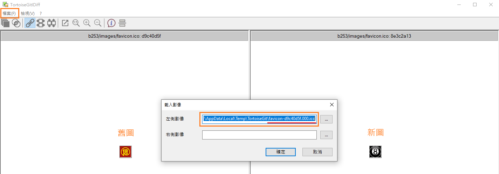

# 需求流程 & TortoiseGit

- [需求流程 & TortoiseGit](#需求流程--tortoisegit)
    - [1. **收到客服需求**](#1-收到客服需求)
    - [2. 提交與推送](#2-提交與推送)
    - [3. **上傳檔案**](#3-上傳檔案)
- [**拉取/推送失敗**](#拉取推送失敗)
- [查看修改日誌](#查看修改日誌)
- [找回覆蓋掉的圖](#找回覆蓋掉的圖)


:::tip 需求流程
做更動前一定要先拉取最新的下來。
若當前資料出現"**!**” , 是指檔案跟最後一次拉下來的不一樣。`=有更動到檔案`
:::
### 1. **收到客服需求**

<div style="background:#e5e5e5;">
🗨️ <br>

 a.確認客服問題 先釐清客服的問題<br> 
- b.查看版本資訊<br>
    `for易博`sky模版號.yb876.com/b123.do <br>
    `for雲迹`sky模版號.yunji9.com/zd.do<br>
 - c. everything搜資料夾 `參考：[版面上傳更新](https://www.notion.so/1402056daecd4d8c8fed7d12f37a9036)`<br>
   不同xxx-member出現相同模板號，以xxx-member後面數字最大為主。<br>
d. 檔案右鍵小烏龜  `確認路徑`<br>
e. 拉取 `update最新資料`<br>
f. 資料夾丟進編輯器裡開始編輯**<br>

</div>

> **客服：d007**后台的icon麻烦配置一下 v09
**網址：[https://skyd007.yb876.com/b123.do](https://skyd007.yb876.com/b123.do)**
> 


### 2. 提交與推送

<aside>
👩🏻‍💻 **若需求很麻煩，修改完檔案請拉到本地端測試做確認
a. 修改後資料夾右鍵
b. Git 提交->master
c. 訊息欄打上模版號
d. 確認修改內容是正確的
e. 提交
f. 推送**

</aside>

### 3. **上傳檔案**

<aside>
📤 **a. [Jenkins](https://jenkins12akp35my2akhao99game88.yb876.com:47531/job/member_update/build?delay=0sec)** 
   `for易博`member 
   `for雲迹`play-member
**b. 左側Build with Parameters
c. 輸入集群號大寫 & 模版號小寫
d. sky網址確認修改結果`建議無痕`**

</aside>

`for 易博`

> ➤**共同集群**
   集群=HA
   ex:集群7 = HA7
➤**獨立集群**
   集群號=模版號
   ex:集群p031=P031
➤**測試集群**
    測試=TEST
   ex:測試2=TEST2
   `只有測試1=TEST 不用打數字`
> 

`for 云迹`

> ➤**共同集群**
   云=WA
   ex:云1 = WA1 
   云VA=VA
   ex:云VA2 = VA2
   眾/zhong = XA
   ex:zhong4  = XA4
➤**獨立集群**
   集群號=模版號
   ex:云h018=h018
➤**測試集群**
    yjtest=WTEST
   ex:yjtest2=WTEST2
   `只有yjtest1=WTEST 不用打數字`
> 


Jenkins介面


b001= yibo11.com


測試1不用打數字

# **拉取/推送失敗**

> **拉取/推送失敗`git衝突`，才輸入下面指令恢復當前最新版本。**`移除本地更動檔案`
輸入指令後所有更動會消失，輸入指令前先確認自己改的東西都正確且備份，不然改過的東西都會不見。
> 

<aside>
👩🏻‍💻 **對修改資料夾右鍵 → git bash here
> git clean -n -f
> git reset --hard origin/master
> git pull
 完成會顯示 Already up to date**

</aside>


# 查看修改日誌

> **資料夾→ 小烏龜 → 拉取檔案→ 顯示日誌 → 可以查看每個人修改的過程**
先拉取檔案才看的到最新修改紀錄。
> 


# 找回覆蓋掉的圖

有時候會遇到租戶更改完圖後要求改回來的需求，此時就要找回被覆蓋的圖。

- **跟尚未拉取檔案的同事要**

此方法僅限當天的需求，通常隔天大家都拉過最新檔了。

- **透過日誌歷史紀錄**

```html
> 修改日誌找到修改紀錄
> 左邊為被覆蓋的舊圖，右邊為修改後的新圖。
> 打開左上角檔案點選開啟
> 。複製**檔名**到放大鏡搜尋
  。**路徑**貼到網址上另存圖檔
```


